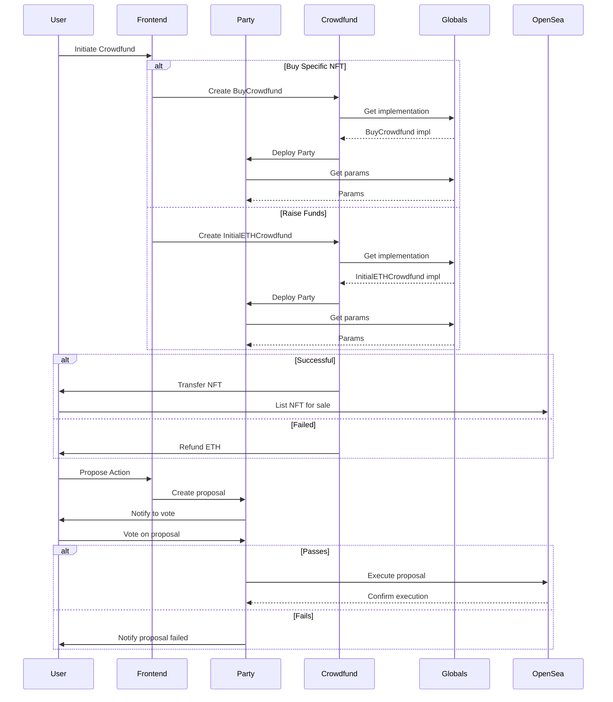
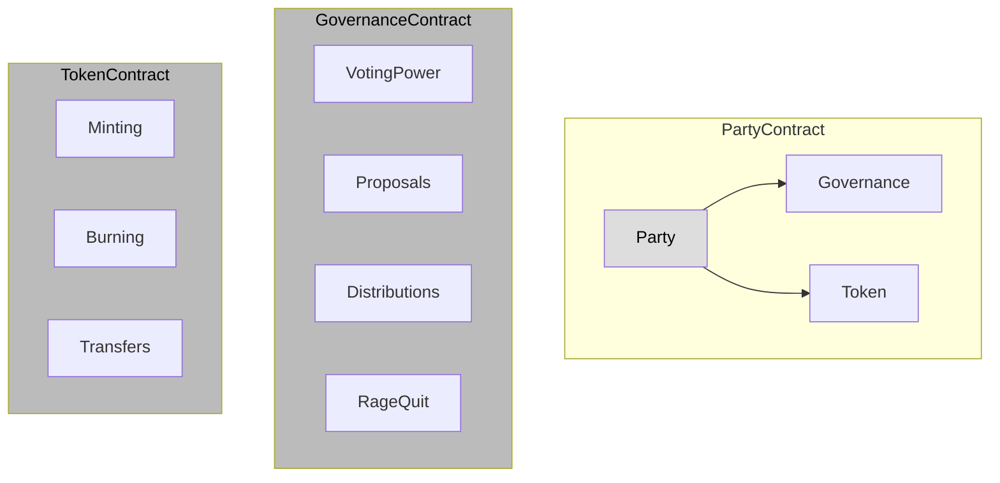
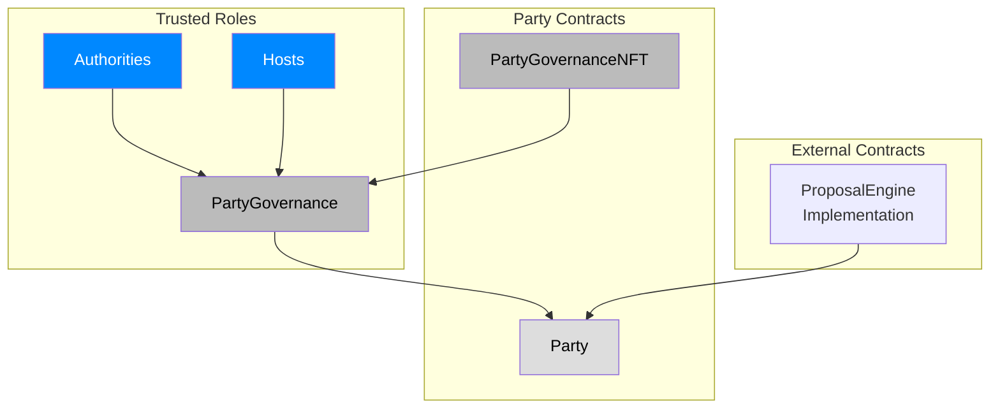
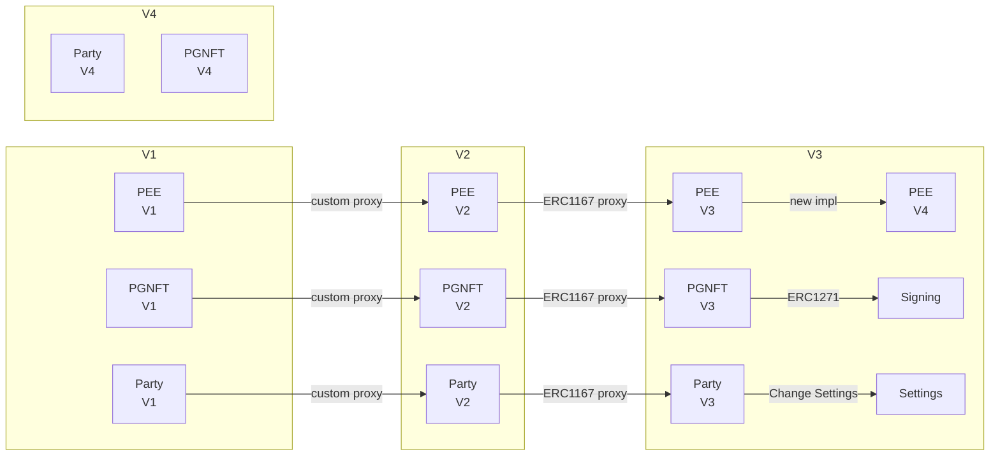

**Overview**

The Party Protocol enables groups to coordinate and collectively govern assets via proposals and voting. The core unit is a Party - a virtual group account that members can make proposals and vote on. Parties are formed via crowdfunds where contributors get voting power. 

### Architecture

The protocol architecture consists of the following key components:

| Component | Description | Key Contracts |
|-|-|-|
| Party | Holds assets, controls governance, token contract for NFTs | Party, PartyGovernance, PartyGovernanceNFT |
| Proposals | Mechanism for members to create and vote on on-chain actions | ProposalExecutionEngine |
| Crowdfund | Manages pooling funds to form a Party | Crowdfund contracts |
| Token Distribution | Distributes assets to Party members | TokenDistributor |
| Gatekeepers | Restricts access to crowdfunds | AllowListGateKeeper, TokenGateKeeper |
| Renderers | Generates metadata for NFTs | Renderer contracts |

The core components are Parties and Proposals. Crowdfund contracts allow the creation of new Parties. 

The other components like Gatekeepers, Renderers, and TokenDistribution provide supporting capabilities.

**The architecture and flow of the Party Protocol:**

This shows:
- User initiates crowdfund via a frontend
- Crowdfund creates Party by getting implementation from Globals
- Party initialized with params from Globals
- After crowdfund, Party can make proposals
- Proposals can execute actions on external platforms like OpenSea

External contracts like Zora are referenced for executing proposals involving those protocols.

| Component | Description | Key Contracts |
|-|-|-|
| Party | Holds assets, controls governance, token contract for NFTs | Party, PartyGovernance, PartyGovernanceNFT |
| Proposals | Mechanism for members to create and vote on on-chain actions | ProposalExecutionEngine |
| Crowdfund | Manages pooling funds to form a Party | Crowdfund contracts |
| Token Distribution | Distributes assets to Party members | TokenDistributor |
| Gatekeepers | Restricts access to crowdfunds | AllowListGateKeeper, TokenGateKeeper |
| Renderers | Generates metadata for NFTs | Renderer contracts |

The core components are Parties and Proposals. Crowdfund contracts allow the creation of new Parties. 

The other components like Gatekeepers, Renderers, and TokenDistribution provide supporting capabilities.

**Security Analysis**

| Issue | Description | Mitigation |
|-|-|-|
| Incorrect voting power snapshots | Potential double counting of votes if snapshot logic has bug | Thorough auditing of voting power accounting code |
| Ruggable assets | Unprotected access to Party's assets like ETH or ERC20s | Audit asset transfer logic and access controls |  
| Malicious proposals | Bad proposals like stealing NFTs or rugging assets | Review proposal types thoroughly, give hosts veto power |
| Flash loan attacks | Quick borrowing of funds to manipulate governance | Use minimum voting and execution delays |

**Smart Contracts**

The main smart contracts are:

| Contract | Purpose |
|-|-|  
| Party | Holds assets, controls governance, token contract for membership NFTs |
| PartyGovernance | Logic for voting, proposals, distributions, ragequit | 
| PartyGovernanceNFT | ERC721 token logic for membership NFTs |
| ProposalExecutionEngine | Executes proposal logic |
| Crowdfund | Manages pooling funds to form a Party |

**Key Mechanisms**

- **Voting Power** - Tracking of voting power for members based on membership NFTs. Complex logic to handle delegation, transfers.
- **Proposals** - Governance mechanism for members to create and vote on proposals. Various types like listings, transactions, etc.
- **Distributions** - Allows assets like ETH and ERC20s to be distributed to members based on voting power.
- **Rage Quit** - Members can burn their NFT and withdraw a portion of assets based on their voting power.

The Voting Power mechanism is a core part of the protocol. It allows tracking the voting rights of each member over time. Key aspects:

- Implemented in PartyGovernance contract.
- Based on ERC721 membership NFTs - each token has voting power value.
- Voting power can be delegated to other members.
- Snapshots record voting power changes.

The complex parts are handling delegation and transfers:

- `_adjustVotingPower` - updates voter and delegate voting power on change.
- `_rebalanceDelegates` - redistributes voting power when delegation changes.
- `_transferVotingPower` - transfers voting power when NFT transferred.
- `_getVotingPowerSnapshotAt` - retrieves voting power at any point in time.

Thorough testing of all edge cases is recommended due to complexity.

The Proposals mechanism allows members to create and vote on on-chain actions.

- Each proposal goes through defined lifecycle (pending, active, passed etc.).
- Various types like listings, transactions, configuration changes.
- Flexible `execute` logic abstracted into ProposalExecutionEngine.

The Distribution mechanism lets parties divide up assets proportionally: 

- Based on relative voting power percentages.
- Utilizes TokenDistributor contract for escrow and claims.
- Configurable fee deduction.

Rage Quit gives members an "exit" option:

- Burn membership NFT to withdraw share of assets.
- Amount proportional to voting power. 
- Requires host to enable ragequit.

This provides liquidity without relying on secondary markets.

Here is a diagram explaining the key mechanisms in the Party Protocol:

The **Party** contract contains the governance logic and tokens.

**GovernanceContract** handles:

- **Voting Power** - Tracking voting power based on NFT holdings, with delegation
- **Proposals** - Lifecycle of proposing and voting on on-chain actions
- **Distributions** - Splitting up assets between NFT holders 
- **RageQuit** - Exit mechanism to burn NFTs and withdraw assets

**TokenContract** implements membership NFTs:

- **Minting** - Creating new NFTs, adjusting voting power
- **Burning** - Destroying NFTs, removing voting power  
- **Transfers** - Moving voting power when NFTs are transferred

The governance and token capabilities combine to form the core mechanisms that allow parties to collectively govern assets.

**Trust Model**

The protocol gives significant authority to these privileged roles:

- **Authorities** - Full control over Party, including minting/burning NFTs.
- **Hosts** - Can unilaterally veto proposals and enable ragequit.

This necessitates authorities and hosts being highly trusted entities.

The Authorities and Hosts have significant control:

- Authorities have full admin rights on Party and NFTs.
- Hosts can veto any proposal and enable ragequit.

Authorities pose the biggest risk if compromised. They should be carefully permissioned contracts rather than trusted individuals. Regular audits are essential.

For hosts, there is safety in numbers - requiring multiple hosts to veto creates decentralization.

Diagram of the Party Protocol's trust model with explanation:

**Authorities** have full administrative privileges over the Party:
- Can mint/burn NFTs
- Adjust voting power
- Add other authorities

Authorities are intended to be highly audited and trusted contracts.

**Hosts** can:
- Unilaterally veto proposals
- Enable ragequit

The Party contract delegates execution logic to the **ProposalEngineImplementation**. This is a trusted dependency that requires security audits. 

The Party also relies on the PartyGovernance and PartyGovernanceNFT contracts for core functionality.

In summary, the Party fully trusts Authorities and Hosts roles as well as the ProposalEngineImplementation and governance contracts. These trusted components should be carefully vetted before deployment.

**All the admin functions and modifiers in the Party Protocol contracts**

**PartyGovernanceNFT.sol**

Admin Functions:

- mint - Mint new NFT 
- burn - Burn NFT
- increaseVotingPower - Increase NFT voting power
- decreaseVotingPower - Decrease NFT voting power
- increaseTotalVotingPower - Increase total voting power
- decreaseTotalVotingPower - Decrease total voting power
- addAuthority - Add approved authority
- abdicateAuthority - Remove self as authority

Modifiers:

- _assertAuthority - Restricts access to authorities

**PartyGovernance.sol**

Admin Functions:

- disableEmergencyExecute - Disable emergency execute capability

Modifiers:

- onlyPartyDaoOrHost - Restrict access to DAO or hosts
- onlyPartyDao - Restrict access to just DAO

**ProposalExecutionEngine.sol**

Admin Functions:

- initialize - Initialize proposal engine impl
- cancelProposal - Cancel stuck proposal

Modifiers: 

- onlyDelegateCall - Restrict access to delegatecalls

**InitialETHCrowdfund.sol**

Admin Functions:

- initialize - Initialize crowdfund parameters

Modifiers:

- onlyInitialize - Restrict to initializer function

**The Party Protocol changelog:**

**Add ERC1271 Signing**

_Explanation:_ Allow Parties to implement ERC1271 interface to enable collective signing of off-chain messages. Useful for web2 app integrations.

_Scenario:_ Party members vote to sign a message allowing them access to a collaborative Docs app.

**Change Governance Settings** 

_Explanation:_ Store governance params like voting duration in separate contract. Allows changing via proposals.

_Scenario:_ Party members vote to reduce voting period from 1 week to 3 days.

**Skip Veto on Full Approval**

_Explanation:_ If all Hosts vote yes, skip the veto waiting period. Speeds up execution.

_Scenario:_ A non-contentious proposal gets quick unanimous Host approval, goes straight to execution.

**Decrease Voting Power**

_Explanation:_ Authorities can now reduce voting power of specific NFTs. Enables fluid adjustments.

_Scenario:_ An external contract burns NFTs if members are inactive, reducing their voting power.

**Decrease Total Voting Power**

_Explanation:_ Authorities can reduce total voting power supply after initializing. Needed since they can now burn NFTs.

_Scenario:_ Authorities burn NFTs, then reduce total supply to match.

**ERC1167 Proxies**

_Explanation:_ Upgrade to ERC1167 for compatibility with tools like Etherscan.

_Scenario:_ Party instances get auto-verified on Etherscan after upgrading.

**Crowdfund Authorities**

_Explanation:_ Crowdfunds can now grant additional authorities to newly formed Parties.

_Scenario:_ Crowdfund makes itself an authority to mint NFTs.

**Move Storage**

_Explanation:_ Shift storage out of Party contract to reduce size.

_Scenario:_ Party contract now fits within size limits for mainnet.

**V2**

- ERC1167 proxies

_Scenario:_ Auto-verify Party on Etherscan 

**V3** 

- ERC1271 signing

_Scenario:_ Party signs message to access Docs app

- Change governance settings

_Scenario:_ Reduce voting period via proposal

**V4**

- New PEE implementation

_Scenario:_ Add special proposal types

**Code Quality**

- Well-structured modular architecture. 
- Heavy reliance on libraries for common utilities.
- Explicit storage pattern reduces risk of collisions.
- Detailed natspec documentation on public methods.
- Use of events for off-chain detection of state changes.

Some areas that could be improved:

- High cyclomatic complexity in parts of the voting power logic.
- Lack of test coverage for some components like `OffChainSignatureValidator`.
- No interface segregation - many large interfaces used.
- Proposal execution logic is not easily upgradable.

Some positives in the code:

- Events used extensively for off-chain detection.
- NatSpec documentation provides clarity.
- Modular architecture and separation of concerns.
- Immutables reduce risk of unintended changes.

To improve:

- Reduce cyclomatic complexity in voting power logic.
- Add more unit test coverage.
- Use interfaces instead of concrete contract types.
- Make proposal engine upgradeable.

**Conclusion**

The Party Protocol demonstrates well-designed modular architecture and has taken care to limit risk surface area. A few areas of concern exist around voting power tracking complexity and privilege levels of roles like authorities.

### Time spent:
38 hours