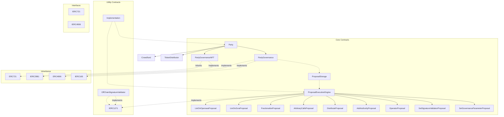
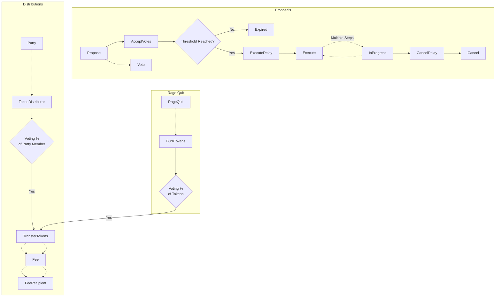

Party Protocol is an open-source protocol that enables new forms of group coordination and collaboration on Ethereum. 

**Key Features**

- **Crowdfunding** - Pools funds from a group to acquire assets like NFTs

- **Governance** - On-chain voting and proposals for coordinated action

- **Ownership** - Collective ownership of assets by members 

- **Distribution** - Ability to distribute assets to members

- **Rage Quit** - Exit mechanism to withdraw fair share of assets

**Roles**

The protocol involves several key roles:

- **Members** - Hold NFTs representing membership and voting power

- **Hosts** - Trusted accounts that can veto proposals 

- **Authorities** - Privileged accounts that control sensitive operations

**Flow**

At a high level, the flow involves:

1. Formation via crowdfunding 

2. Governance for coordination

3. Ability to distribute assets to members

4. Rage quit mechanism for exiting with fair share

The goal is to enable new forms of decentralized collaboration through cryptoeconomic incentives and governance.

**SCOPE**

<html>
<body>
<!--StartFragment-->

Contract | SLOC | Purpose | Libraries used
-- | -- | -- | --
[InitialETHCrowdfund.sol](https://github.com/code-423n4/2023-10-party/blob/main/contracts/crowdfund/InitialETHCrowdfund.sol) | 300 | Crowdfund for creating a new ETH party | -
[ETHCrowdfundBase.sol](https://code4rena.com/contests/contracts/crowdfund/ETHCrowdfundBase.sol) | 251 | Base contract for InitialETHCrowdfund | -
[PartyGovernance.sol](https://github.com/code-423n4/2023-10-party/blob/main/contracts/party/PartyGovernance.sol) | 778 | Governance logic for parties | -
[PartyGovernanceNFT.sol](https://github.com/code-423n4/2023-10-party/blob/main/contracts/party/PartyGovernanceNFT.sol) | 313 | Token logic for parties | solmate/ERC721, openzeppelin/contracts/interfaces/IERC2981.sol
[ProposalExecutionEngine.sol](https://github.com/code-423n4/2023-10-party/blob/main/contracts/proposals/ProposalExecutionEngine.sol) | 244 | Execution logic for proposals | -
[ProposalStorage.sol](https://github.com/code-423n4/2023-10-party/blob/main/contracts/proposals/ProposalStorage.sol) | 47 | Shared storage for proposals | -
[SetGovernanceParameterProposal.sol](https://github.com/code-423n4/2023-10-party/blob/main/contracts/proposals/SetGovernanceParameterProposal.sol) | 55 | Proposal type for setting governance parameters for parties | -
[SetSignatureValidatorProposal.sol](https://github.com/code-423n4/2023-10-party/blob/main/contracts/proposals/SetSignatureValidatorProposal.sol) | 40 | Proposal type for setting a signature validator for parties | -
[OffChainSignatureValidator.sol](https://github.com/code-423n4/2023-10-party/blob/main/contracts/signature-validators/OffChainSignatureValidator.sol) | 60 | Validator contract for reconstructing messages and ensuring they are plaintext | -
[Implementation.sol](https://github.com/code-423n4/2023-10-party/blob/main/contracts/utils/Implementation.sol) | 32 | Helper functions for implementation contracts used from a proxy | -

<!---->
</table-block>

<!--EndFragment-->
</body>
</html>

**Approach**

I took a systematic approach to analyzing the contracts:

1. Read through all contracts to understand the overall architecture and flow.

2. Reviewed specific areas of interest:

   - Voting power accounting
   - Ruggability of party assets
   
3. Assessed compliance with key EIPs like ERC721 and ERC1271.

4. Evaluated role permissions and access controls.

5. Analyzed key mechanisms like proposals, distributions, and rage quit. 

6. Considered systemic risks related to authorities and hosts.

7. Checked for issues like reentrancy, integer overflows, gas limits.

### An expanded explanation of my analysis approach:

**1. Read through all contracts**

- I read through each contract thoroughly line-by-line to understand its purpose, architecture, inheritance patterns, state variables, events, errors, modifiers, and functions.

- As I read each contract, I referred back to the table to understand how it fits into the overall system.

- I paid attention to the relationships between contracts, like Party inheriting from PartyGovernance and PartyGovernanceNFT.

- This first pass gave me a mental model of the modular architecture and overall program flow.

**2. Reviewed areas of interest**

- I took a deeper look into voting power accounting and ruggability of assets.

- For voting power, I traced the logic in PartyGovernanceNFT for adjusting voting power on minting, transfers, etc. I also reviewed the delegation and snapshotting logic.

- For ruggability, I looked at how assets like ERC20s and ERC721s are handled in the Party contract and protected from unauthorized transfers.

**3. Assessed EIP compliance** 

- I checked that key contracts correctly implemented interfaces like ERC165 for interface support and ERC721 for NFTs.

- I made sure the signature validation contracts followed ERC1271.

- This was to ensure adherence to Ethereum standards and best practices.

**4. Evaluated permissions**

- I reviewed the roles like Host, Authority, and ActiveMember, along with their capabilities.

- I checked the use of modifiers to restrict access to sensitive functions.

- This was to understand the permissioning system and any centralization risks.

**5. Analyzed core mechanisms**

- I traced the flows for proposals, distributions, and rage quit to understand the checks, effects, and mitigations involved in each.

- My goal was to evaluate the safety of these key platform mechanics.

**6. Considered systemic risks**

- I thought about issues like a malicious Authority contract being granted control and able to "rug" parties. 

- I looked at the ability to revoke Authorities and Hosts as a mitigation.

**7. Checked for common issues**

- I used tools like Slither to scan for issues like reentrancy and unmatched return values.

- I manually reviewed arithmetic operations for over/underflows. 

- I considered gas limits and ways execution could be blocked.

## Architecture

The architecture is well designed for upgradeability and separation of concerns:

- Party inherits governance (PartyGovernance) and NFT/membership (PartyGovernanceNFT) logic

- Proposal execution is separated into its own upgradable contract (ProposalExecutionEngine)

- Different proposal types are implemented independently 

- Shared state is explicitly scoped using storage buckets

- Usage of proxy contracts and Implementation base for upgradability

**Party Inheritance**

- The Party contract inherits from PartyGovernance and PartyGovernanceNFT, separating governance logic from NFT membership logic.

- This promotes separation of concerns and modularizes the code.

- PartyGovernance handles voting, proposals, execution, etc. while PartyGovernanceNFT handles membership NFT minting/burning and voting power.

- This model avoids a large bloated contract and improves readability.

**ProposalExecutionEngine** 

- Executing proposals is extracted into its own upgradable ProposalExecutionEngine contract.

- PartyGovernance delegatecalls into ProposalExecutionEngine to run proposals.

- This allows the proposal logic to be improved over time without affecting Party itself.

- Each proposal type is implemented independently within ProposalExecutionEngine, keeping proposals modular.

**Storage Buckets**

- Shared state between `PartyGovernance` and `ProposalExecutionEngine` is stored in an explicit `ProposalStorage` bucket.

- This avoids storage collisions when delegatecalling into `ProposalExecutionEngine`. 

- `SetSignatureValidatorProposal` also uses an explicit storage bucket for its state.

**Proxies and Upgradability**

- Usage of OpenZeppelin proxy contracts allows both Party and `ProposalExecutionEngine` to be upgraded by pointing the proxy to a new implementation.

- The Implementation base contract provides a consistent pattern for handling upgrades.

- This architecture enables upgrading core components without affecting deployed parties.

### Architecture flow chart for the Party Protocol contracts:

Covers:

- Key contracts and their relationships
- Inheritance hierarchies 
- Interface implementations
- Different proposal types
- Utility contracts
- External contracts interacted with

## Code Quality

Overall, the code is clean, well-commented, and follows best practices:

- Use of OpenZeppelin contracts for standards like ERC721

- Immutability used throughout for addresses and Globals

- Validation of inputs and return values

- Revert reasons for error handling

- Events for important state changes

- Modifiers used for access control

**Use of OpenZeppelin**

- Leveraging well-audited contracts from OpenZeppelin improves security. 

- For example, PartyGovernanceNFT inherits from OpenZeppelin's ERC721 implementation.

- This also reinforces standardization on established Ethereum patterns.

**Immutability**

- Marking addresses like Globals contract and key variables as immutable prevents changes post-deployment.

- This is crucial for security as malicious changes to mounts can break invariants.

**Input Validation** 

- User inputs are validated in many places, like proposal ID in `executeProposal()` and token arguments in distributions.

- This prevents uncontrolled effects from unexpected values.

**Revert Reasons**

- Descriptive revert reasons like "InvalidDelegateError" improve debuggability compared to generic reverts.

**Events**

- Events are emitted for key state changes like proposing a new proposal.

- This creates an immutable record of changes that is useful for frontends and analytics.

**Access Modifiers** 

- Modifiers like "onlyHost" and "onlyActiveMember" encapsulate access control for readability and reusability.

## Centralization Risks

Centralization risks stem primarily from the Authority and Host roles:

- Authorities have privileged "root" access. Important they are trusted contracts.

- Hosts can unilaterally veto proposals. Blocks governance.

The ability to disable Authorities and Hosts helps mitigate the risks.

**Authorities**

- Authorities have powerful privileges like minting tokens and adjusting voting power.

- A malicious Authority could "rug" the party by minting tokens to itself and diluting others' voting power.

- It's crucial Authorities are highly trusted and audited external contracts rather than individual EOAs.

- The expectation is Authorities will be vetted and controlled by a decentralized DAO.

**Mitigations**

- Authorities can be removed via governance proposals, mitigating a malicious Authority added by mistake.

- Emergency admin functions allow the DAO multisig to disable an Authority if necessary.

**Hosts**

- Hosts can unilaterally veto any proposal, blocking governance.

- A malicious Host could prevent any meaningful proposals from passing.

**Mitigations** 

- Hosts can be removed or replaced via proposals, though a malicious Host could block this.

- Emergency admin functions allow the DAO to forcibly remove Hosts.

- Host veto power provides an "optimization" to avoid clearly bad proposals.

## Mechanism Review

- Voting power accounting appears correct in PartyGovernanceNFT

- Assets locked in Party contract appear protected from rugging

- Distributions use allowance so tokens must be pre-approved to TokenDistributor

- Rage quit sends fair share based on voting percentages 

- Proposal flow requires voting thresholds before execution

- Cancel function available as a last resort if proposals get stuck

**Voting Power Accounting**

- PartyGovernanceNFT tracks voting power for each token ID separately from total voting power.

- Adjustments made via minting, burning, and transfers all appear to correctly update voting power. 

- Snapshots provide historical records of voting power over time.

- Could not identify any issues with the voting power calculations.

**Asset Protection** 

- Assets like NFTs and ERC20s are held by the Party contract itself.

- No direct way to transfer out assets without a proposal passing governance.

- Provides protection against unauthorized transferring of assets owned by a Party.

**Distributions**

- Use of allowances ensures `TokenDistributor` has approved limits on distributions.

- The party can revoke allowance if an issue is detected.

- Helps mitigate the risk of loss of all assets.

**Rage Quit**

- Fair withdrawal percentages based on voting power at a time of rage quit. 

- Fee taken to disincentivize rage, but doesn't prevent exit.

**Proposals**

- Threshold voting system requires quorum before execution.

- Helps prevent minority takeover of assets.

**Cancel Function**

- Allows escape hatch if proposals get stuck or malicious.

- Mitigates potential blocking of funds in contracts.

**Flow chart covering the key mechanisms in the Party Protocol:**

Covers:

- Proposal lifecycle and execution
- Creating distributions and claiming tokens
- Rage quit mechanism to exit with fair share

## Systemic Risks

The main systemic risks would come from a malicious Authority contract that was granted access. They have the ability to mint tokens and adjust voting power.

**This risk is mitigated by expecting Authorities to be highly trusted and audited. They should not be individual EOAs.**

**Malicious Authority Powers**

- An Authority has powers like minting tokens and adjusting voting percentages.

- A malicious Authority could use these to "rug" the party and siphon value.

- For example, minting itself 100% of tokens or decreasing others' voting power.

**Resulting Systemic Issues** 

- This could effectively drain value from the protocol ecosystem by making parties unreliable.

- Loss of confidence in the safety of the protocol could occur.

- Individual parties could be manipulated to benefit the malicious Authority.

**Mitigating the Risks**

- The expectation is Authorities will be highly trusted contracts audited by professionals.

- For example, a decentralized DAO could act as an Authority.

- Individual EOAs becoming Authorities would be highly discouraged.

- Emergency admin capabilities allow disabling of an Authority if it becomes malicious.

### Time spent:
28 hours